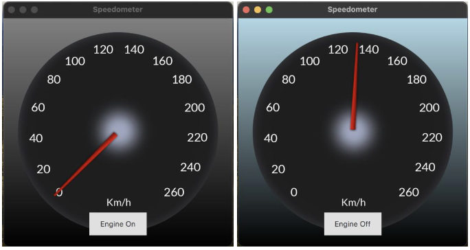

# Vehicle Speedometer Dashboard Application

## Overview
The **Vehicle Speedometer Dashboard** is an interactive QtQuick application that simulates a vehicle speedometer with engine on/off functionality. It also includes features like **acceleration**, **braking**, and **dynamic needle movement**. This application demonstrates a simple, visual speedometer using state management and smooth animations.

---

## Features

### 1. **Engine On/Off Toggle**
- Users can start or stop the engine using a button.
- The UI reflects the engine state with:
   - **Engine On**: Needle moves to a specific position.
   - **Engine Off**: Needle resets to the default position.

### 2. **Dynamic Needle Movement**
- The speedometer needle animates smoothly when transitioning between positions.
- Animations include:
   - A gradual movement of the needle when the engine is toggled.
   - Easing functions for natural, smooth movement.

### 3. **Gradient Background**
- The background dynamically changes based on the engine state:
   - **Light blue gradient** when the engine is **On**.
   - **Gray gradient** when the engine is **Off**.

---

## User Interaction
- **Button Control**: The button toggles the engine state.
   - Button text dynamically updates to indicate the current engine state (e.g., "Engine On" or "Engine Off").
- **Speedometer Visualization**:
   - A base speedometer image serves as the static interface.
   - A rotating needle reflects the engine state or simulated speed.

---

## States and Transitions

### Engine States:
1. **Engine Off**:
   - The needle resets to its default position (e.g., -135°).
   - The background turns gray to indicate inactivity.

2. **Engine On**:
   - The needle moves to a predefined position (e.g., 10°) to represent the engine starting.
   - The background changes to a light blue gradient.

### Transitions:
- **Needle Animation**:
   - Smooth animations are implemented using `NumberAnimation`.
   - Duration and easing functions ensure natural motion.
- **State Transitions**:
   - Transitions occur dynamically when toggling between engine states.

---

## UI Layout

1. **Speedometer Image**:
   - A static base image representing the speedometer.
2. **Needle Image**:
   - A dynamic image for the needle, which rotates smoothly based on engine state.
3. **Engine Toggle Button**:
   - Centrally located at the bottom for intuitive user interaction.
4. **Dynamic Background**:
   - Visual feedback through gradient changes enhances the user experience.

---

## Animation and Interactivity
- **Needle Rotation**:
   - The needle rotates smoothly with a duration of 500–2000 milliseconds.
   - Easing functions like **OutQuad** are applied for realistic movement.
- **Engine Toggle**:
   - Toggle animations ensure immediate and visually appealing state changes.

---

## Summary
The **Vehicle Speedometer Dashboard** is a simple yet effective application demonstrating the power of **QtQuick** for UI development. It combines state management, smooth animations, and interactive elements to deliver a realistic and visually engaging speedometer simulation.
